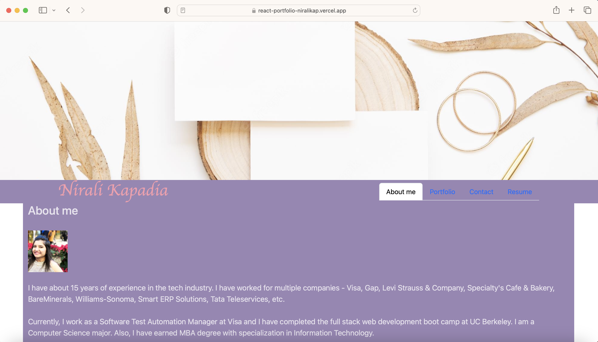
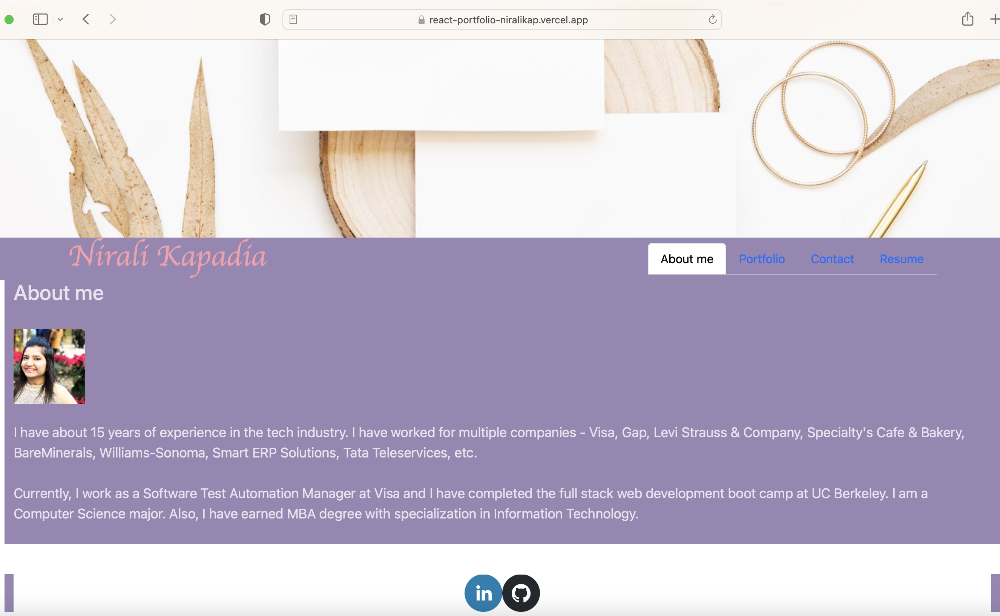
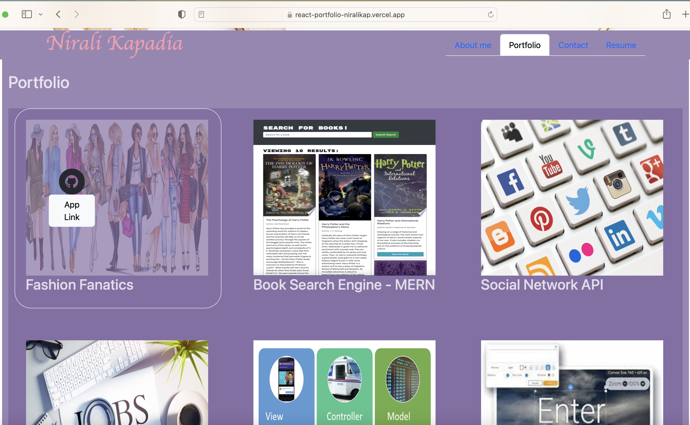
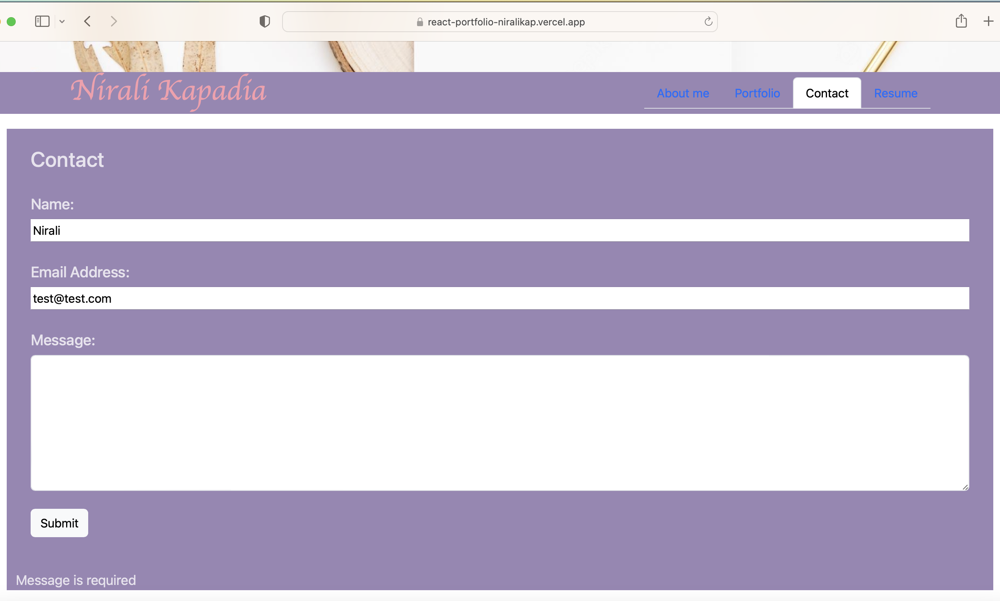
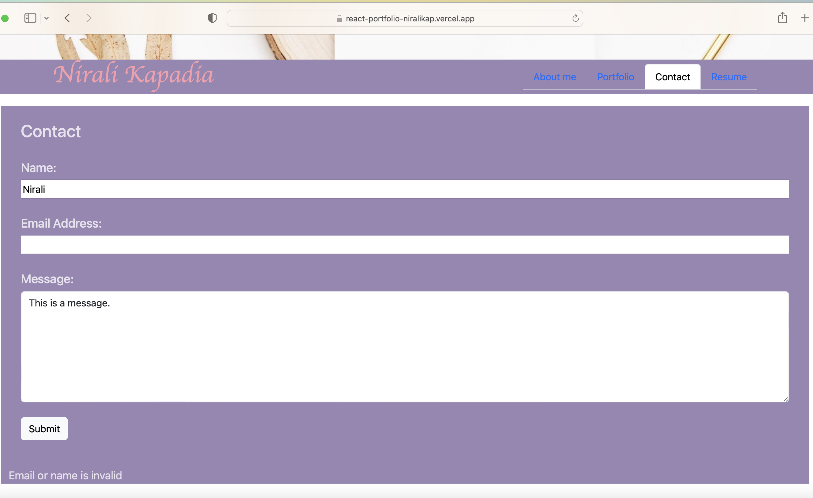
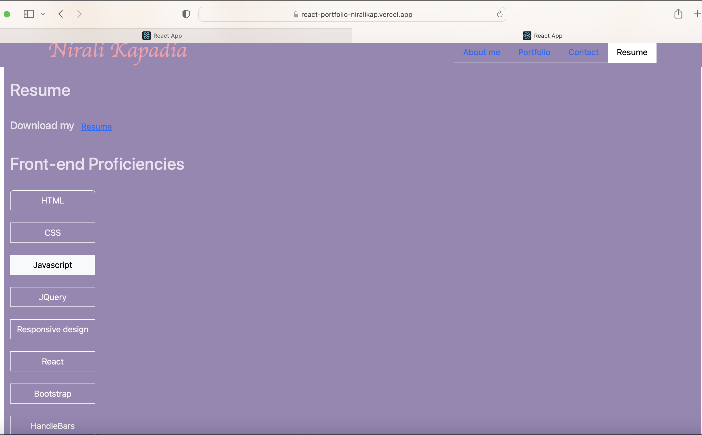

# React-Portfolio

## User Story

```md
AS AN employer looking for candidates with experience building single-page applications
I WANT to view a potential employee's deployed React portfolio of work samples
SO THAT I can assess whether they're a good candidate for an open position
```

## Description

In this assignment, I have created a professional portfolio using React. This portfolio uses the latest technologies to showcase my react skills.

It does the following:

-Given a single-page application portfolio for a web developer
When I load the portfolio, then I am presented with a page containing a header, a section for content, and a footer.

-When I view the header, then I am presented with the developer's name and navigation with titles corresponding to different sections of the portfolio

-When I view the navigation titles, then I am presented with the titles About Me, Portfolio, Contact, and Resume, and the title corresponding to the current section is highlighted.

-When I click on a navigation title, then I am presented with the corresponding section below the navigation without the page reloading and that title is highlighted.

-When I load the portfolio the first time, then the About Me title and section are selected by default.

- When I am presented with the About Me section, then I see a recent photo or avatar of the developer and a short bio about them.

- When I am presented with the Portfolio section, then I see titled images of six of the developer’s applications with links to both the deployed applications and the corresponding GitHub repositories.

- When I am presented with the Contact section, then I see a contact form with fields for a name, an email address, and a message.

- When I move my cursor out of one of the form fields without entering text, then I receive a notification that this field is required.

- When I enter text into the email address field, then I receive a notification if I have entered an invalid email address.

- When I am presented with the Resume section, then I see a link to a downloadable resume and a list of the developer’s proficiencies.

- When I view the footer, then I am presented with text or icon links to the developer’s GitHub and LinkedIn profiles, and their profile on a third platform (Stack Overflow, Twitter).

## Installation Instructions

In order to run the app, we need to run the following commands:

- npx create-react-app : This will create the public folder with all the necessary files.
- npm i - This will install the node modules.
- npm i react-social-icons : This will help retrieve the actual icons of the app from the link provided.
- npm i bootstrap : This will help retrieve the bootstrap library.
- npm start : This will help run the app.

## Deployment

The app is successfully deployed. The link is:

https://react-portfolio-niralikap.vercel.app


## Screenshots









